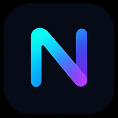
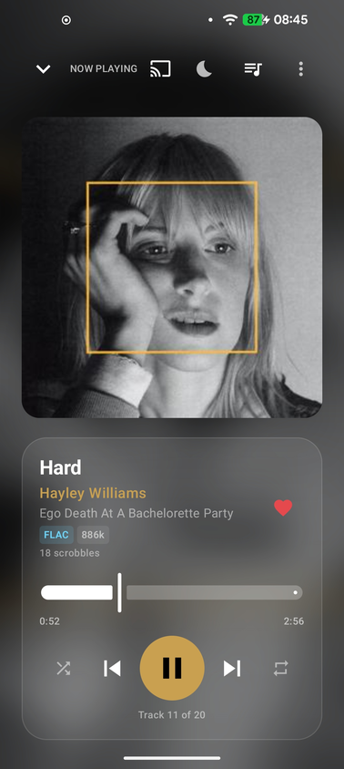
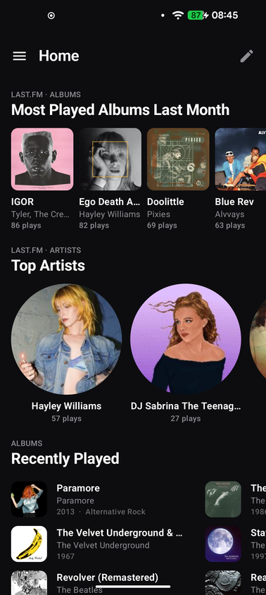
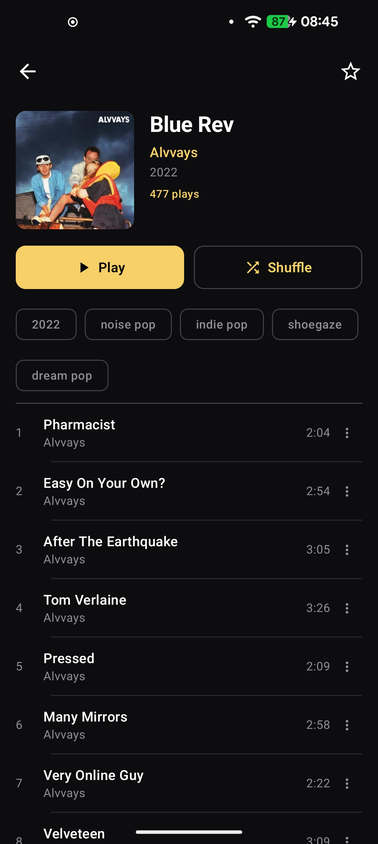
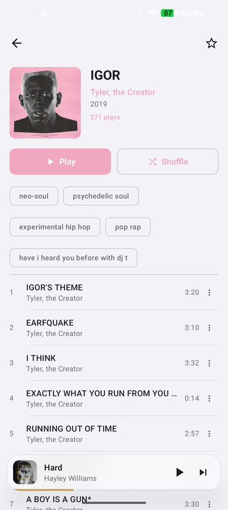
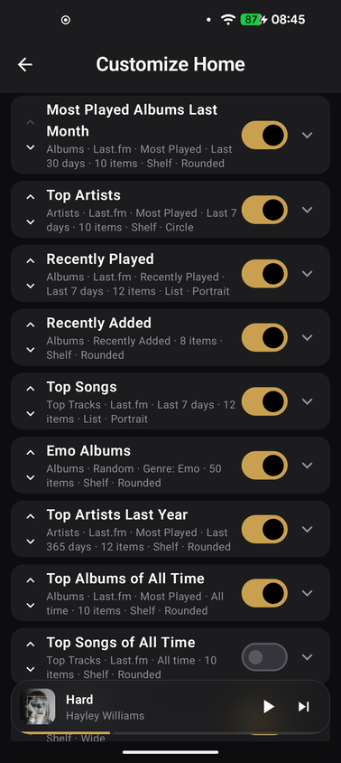

<p align="center">
  
</p>

<h1 align="center">Neiro (音色)</h1>

<p align="center">
  An Android music client for <a href="https://opensubsonic.netlify.app/">OpenSubsonic</a> / <a href="https://www.navidrome.org/">Navidrome</a> — built for music lovers, Last.fm nerds, and anyone who wanted Apple Music's look on their own server.<br/>
  Dynamic album-art color theming, liquid-glass mini player, and deep Last.fm integration.
</p>

<p align="center">
  <a href="https://github.com/FabianZettl/Neiro/releases/latest">
    
  </a>
  
  
</p>

---

## 📸 Screenshots

<p align="center">
  
  
  
  
  
</p>

---

## ✨ Features

### 🎨 Dynamic Color Theming
- Every screen adapts its color scheme to the current album art via the Palette API
- Smooth animated transitions between color palettes when the song changes
- Toggle between dynamic color and a fixed accent color (8 presets)
- Full Light / Dark / System theme support

### 🎵 Playback
- Streams directly from your OpenSubsonic/Navidrome server — no downloads, no caching
- Media3/ExoPlayer backend with lock-screen controls and persistent notification
- Configurable streaming quality (Original / 320 / 256 / 192 / 128 kbps)
- AutoDJ: automatically queues similar tracks when the queue runs out
- Sleep timer with countdown display
- Play, shuffle, repeat, skip, seek, play-next, add-to-queue

### 🪟 Now Playing
- Fullscreen player with blurred album art background and glass card UI
- Liquid-glass mini player with real-time haze/blur effect
- Album art cross-fade animation on track change
- Lyrics display (OpenSubsonic structured lyrics)
- Audio format / bitrate quality badge (FLAC, MP3, etc.)
- "Share Now Playing" card (generated image with album art)
- Sleep timer with live countdown

### 🏠 Home Screen
- Fully configurable sections with drag-to-reorder, enable/disable, custom titles
- Album sections: Recently Added, Random, Top Rated, By Genre, By Year, Most Played
- Artist sections with optional genre filter and sort options
- **Last.fm Top Artists** and **Top Albums** — cross-referenced with your library for cover art and navigation, configurable time range
- **Top Tracks** from Last.fm with play count display
- **Latest Podcast Episodes** section

### 📊 Last.fm Integration
- Personal play counts on album and artist pages
- Top Albums, Top Artists, Top Tracks on the home screen — all time, last year, last month, last week
- Loved track indicators (❤️) in album track lists
- Love / unlove tracks directly from the fullscreen player
- Scrobbling via the Subsonic `scrobble` endpoint
- Configures via Settings with your own API key + session auth

### 📚 Library
- Artist detail pages: biography, genre chips, external links (Last.fm, Wikipedia, RateYourMusic), album grid
- Album detail: compact header, full track list with duration and loved indicators
- Sort and search in Artists, Albums, and Playlists lists
- Multi-column list layout option
- Playlists, starred tracks, search

### 🎙️ Podcasts
- Subscribe to any podcast via RSS feed URL
- Import/export subscriptions via OPML file
- Episode list with artwork, date, and duration
- Stream episodes directly — no downloads needed
- Latest episodes as an activatable Home section

### 📻 Internet Radio
- Browse and play internet radio stations from your Navidrome server

### 🖼 Home Screen Widget
- Now-playing widget with album art, track info, play/pause and skip controls

---

## 📦 Installation

1. Go to [**Releases**](https://github.com/FabianZettl/Neiro/releases/latest) and download the latest APK
2. Enable *Install from unknown sources* on your Android device
3. Install and open Neiro
4. In Settings, enter your Navidrome/Subsonic server URL, username and password

> Requires **Android 8.0 (API 26)** or higher.

---

## 🔧 Build from Source

```bash
git clone https://github.com/FabianZettl/Neiro.git
cd Neiro
./gradlew assembleDebug
# APK: app/build/outputs/apk/debug/app-debug.apk
```

Requires Android SDK with min SDK 26, target SDK 35.

---

## 📋 Changelog

### v0.2.0-alpha *(2025-06-11)*

**New features**
- Podcast support: subscribe via RSS URL, import via OPML, episode streaming, Latest Episodes home section
- Internet Radio: browse and play stations from your Navidrome server
- Sleep timer with live countdown in the player
- Sort + search in Albums, Artists, and Playlists library screens
- AutoDJ: auto-queues similar tracks when queue ends
- Audio quality badges in the fullscreen player (format + bitrate)
- "Share Now Playing" card from the player overflow menu
- Home screen widget (album art, track, play/pause, skip)
- Genre tags and multi-genre filtering on albums
- Multiple column list layout option for library screens

**Improvements**
- Last.fm stats driven by sort type — no separate picker
- Seekbar fix via `timeOffset` parameter for transcoded streams
- Animated song crossfade in fullscreen player
- Lyrics support (OpenSubsonic structured lyrics)
- Home sections: drag-to-reorder, enable/disable, add custom sections

**Bug fixes**
- Fixed crash when playing songs (widget update on main thread)
- Fixed navigation back from Now Playing screen
- Fixed palette extraction using wrong fallback colors in light mode
- Drawer always uses dark theme to prevent white-on-white rendering

**Removed**
- Chromecast support (removed for stability; may return in a future release)

### v0.1.0-alpha *(2025-06-09)*
- Initial public pre-release
- Dynamic album-art color theming with animated transitions
- Fullscreen player with blurred background and glass card
- Liquid-glass mini player (haze/blur overlay)
- Home screen with configurable, reorderable sections
- Last.fm integration: top charts, play counts, loved tracks, love/unlove
- Library: artists, albums, playlists, starred, search
- Album detail: compact Apple Music-style header
- Artist detail: biography, stats, external links
- OpenSubsonic MD5 auth, streaming quality selector
- Light / Dark / System theme + accent color selector
- Queue: play-next and add-to-queue from album track list

---

## 🛠️ Tech Stack

| | |
|---|---|
| Language | Kotlin |
| UI | Jetpack Compose + Material 3 |
| Player | AndroidX Media3 / ExoPlayer |
| Networking | Retrofit 2 + OkHttp 3 |
| Images | Coil |
| Color Theming | AndroidX Palette API |
| Blur / Glass | [haze](https://github.com/chrisbanes/haze) by chrisbanes |
| DI | Hilt |
| Storage | DataStore Preferences |
| Navigation | Compose Navigation |

---

## ⚠️ Known Limitations (alpha)

- No tablet / landscape layout optimisation
- No ReplayGain support yet
- Podcast playback does not save resume position yet
- No podcast search/discovery (subscribe by URL or OPML only)

---

## 📄 License

MIT
